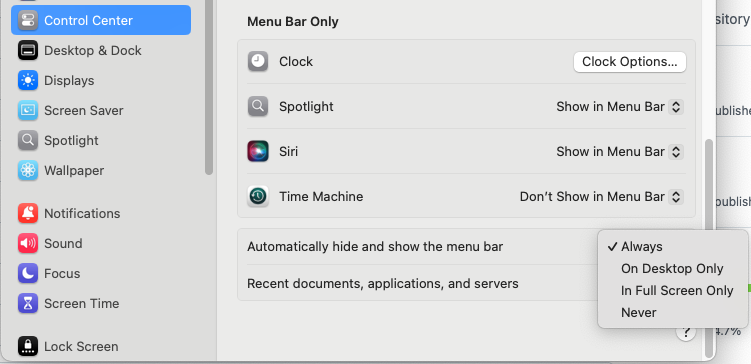

# My Dotfiles

This repository contains my personal dotfiles and setup scripts for a new macOS/Linux system. It includes configurations for:

- Zsh with Oh My Zsh
- Powerlevel10k theme
- zsh-autosuggestions
- zsh-syntax-highlighting
- eza (modern ls replacement)
- zoxide (smart cd command)
- skhd (hotkey daemon)
- yabai (window manager)
- iterm2 (terminal)

## Installation

1. Clone this repository into your home directory:

```bash
git clone https://github.com/gusleig/gusdotfiles.git ~/.dotfiles
```

2. Run the installation script:

```bash
cd ~/.dotfiles
chmod +x install.sh
./install.sh
./install_sketchybar.sh
```
For Sketchybar, disable the menu bar in Control Center settings:



## What's Included

### Directory Structure

```
~/.dotfiles/
├── install.sh              # Main installation script
├── README.md              # This file
└── dotfiles/
    ├── skhdrc.symlink     # skhd configuration
    ├── yabairc.symlink    # yabai configuration
    └── ... other config files
```

### Configurations

The script will:

1. Install required packages (zsh, git, curl, etc.)
2. Set up Oh My Zsh with Powerlevel10k theme
3. Install and configure plugins:
   - zsh-autosuggestions
   - zsh-syntax-highlighting
4. Install and configure utilities:
   - eza (modern ls replacement)
   - zoxide (smart cd navigation)
5. Symlink all configuration files from `dotfiles/*.symlink` to your home directory
   - For example: `~/.dotfiles/dotfiles/skhdrc.symlink` → `~/.skhdrc`

### Post-Installation

After running the installation script:

1. Restart your terminal
2. Set your terminal font to MesloLGS NF
3. Run `p10k configure` to set up Powerlevel10k
4. Verify that all symlinks are correctly created:
   ```bash
   ls -la ~ | grep -e .skhd -e .yabai
   ```

## Adding New Dotfiles

To add a new configuration file:

1. Add your configuration file to the `dotfiles/` directory with the `.symlink` extension
2. The installation script will automatically create the appropriate symlink in your home directory

## Customization

- Modify any `.symlink` files in the `dotfiles/` directory to customize your configurations
- Changes will be tracked by git and can be version controlled

Disabling System Integrity Protection:

Yabai needs to run without System Integrity Protection to work correctly.

For Macs with silicon chip:

In system restore:

```bash
csrutil enable --without fs --without debug --without nvram
```

After a normal reboot:

```bash
sudo nvram boot-args=-arm64e_preview_abi
```

if the last command doesn't work, try (in system restore):

```bash
csrutil disable
```

Refer to this official documentation:

- [Disabling System Integrity Protection](https://github.com/koekeishiya/yabai/wiki/Disabling-System-Integrity-Protection)

## Reloading Configurations
After modifying configuration files, restart the respective service:

```bash
# For yabai
yabai --restart-service

# For skhd
skhd --restart-service
```

## Troubleshooting

### Symlink Issues

If symlinks aren't created correctly:

```bash
# Manually create symlinks
ln -sf ~/.dotfiles/dotfiles/skhdrc.symlink ~/.skhdrc
ln -sf ~/.dotfiles/dotfiles/yabairc.symlink ~/.yabairc
```

If hotkeys aren't working:

- Ensure skhd service is running: skhd --check-service
- Check permissions in System Preferences
- View skhd logs:
```bash
tail -f ~/.skhd.log
tail -f ~/.skhd.err.log
```

For yabai issues:

- Check if service is running: yabai --check-service
- View yabai logs:
```bash
tail -f ~/.yabai.log
tail -f ~/.yabai.err.log
```


### Font Issues

If the Powerlevel10k icons don't display correctly:

1. Verify that MesloLGS NF is installed
2. Set your terminal font to MesloLGS NF
3. Restart your terminal

## Updating

To update your dotfiles:

```bash
cd ~/.dotfiles
git pull
./install.sh  # Will update symlinks and configurations
```
