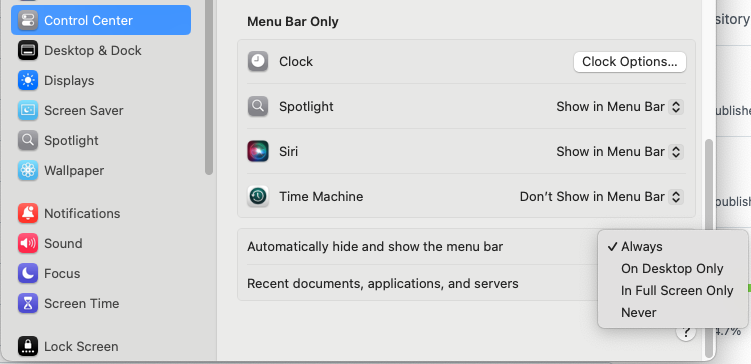

# My Dotfiles

Personal dotfiles and setup scripts for macOS/Linux. Includes Zsh (Oh My Zsh + Powerlevel10k), a terminal-first tool stack, optional yabai/skhd/sketchybar, and a custom git worktree helper.

## Installation

1. Clone this repository into your home directory:

```bash
git clone https://github.com/gusleig/gusdotfiles.git ~/.dotfiles
```

2. Run the installation script:

```bash
cd ~/.dotfiles
chmod +x install.sh
./install.sh
```

The script will prompt you for:

- **Terminal:** iTerm2 or Ghostty
- **Sketchybar** (status bar): optional
- **AWS CLI** (includes S3): optional
- **Update now:** optionally update Homebrew, Oh My Zsh, and plugins right after install

To only update installed software later:

```bash
./install.sh update
```

For Sketchybar (if you chose to install it), disable the menu bar in **System Settings → Control Center**.

### Install context for AI (Cursor and Claude Code)

The install script makes the list of installed CLI tools visible to AI so it can suggest valid commands (eza, bat, rg, fd, lazygit, lazydocker, gwtree, etc.).

- **Cursor**  
  Symlinks `.cursor/rules/` to `~/.cursor/rules/`. The rule **installed-tools.mdc** applies when you work in this repo or in a workspace that includes `~/.cursor/rules/`.  
  For other projects: copy `~/.dotfiles/.cursor/rules/installed-tools.mdc` into that project’s `.cursor/rules/`, or add it via **Cursor → Settings → Rules → User Rules**.

- **Claude Code only (no Cursor)**  
  Claude Code loads context from **~/.claude/CLAUDE.md**. The install script:
  - Symlinks `~/.claude/dotfiles-tools.md` → this repo’s `claude/dotfiles-tools.md`.
  - If `~/.claude/CLAUDE.md` does not exist, creates it with the tools list.
  - If it already exists, appends the tools section once (skips if already present).

  So if you use Claude Code but not Cursor, the same tools list is still loaded from `~/.claude/CLAUDE.md`.



## Directory Structure

```
~/.dotfiles/
├── install.sh              # Main installation script
├── install_sketchybar.sh   # Sketchybar setup (optional, run via install.sh prompt)
├── Brewfile                # Source of truth for all brew-managed packages
├── README.md
├── .cursor/
│   └── rules/
│       └── installed-tools.mdc   # Cursor: rule listing available CLI tools
├── claude/
│   └── dotfiles-tools.md        # Claude Code: same tools list for ~/.claude/CLAUDE.md
├── scripts/
│   ├── dotfiles-doctor.sh       # Health check (`dotfiles doctor`)
│   ├── dotfiles-rollback.sh     # Restore ~/.zshrc backup (`dotfiles rollback`)
│   └── fix-vscode-settings.sh
├── dotfiles/
│   ├── skhdrc.symlink      # skhd hotkey config
│   ├── yabairc.symlink     # yabai window manager config
│   └── zsh/zshrc.d/        # Modular zsh snippets sourced by ~/.zshrc
│       ├── 00-eza-zoxide.zsh
│       ├── 05-dotfiles-cli.zsh
│       ├── 10-gwtree.zsh
│       ├── 20-fzf.zsh
│       └── 99-local.zsh   # sources ~/.zshrc.local (your work-specific config)
├── borders/
│   └── bordersrc.symlink   # yabai borders config
└── sketchybar/            # sketchybar config (if used)
```

## Tools

Brief intro and examples for each tool installed by the script.

### Shell & navigation

- **eza** — Modern `ls` with icons and better defaults.  
  `ls` is aliased to `eza --icons=always`.  
  Examples: `ls`, `ls -la`, `ls -T` (tree).

- **zoxide** — Smarter `cd` using your history.  
  Examples: `z proj` (jump to a path containing “proj”), `z ~/code/foo`.

- **fzf** — Fuzzy finder.  
  **Ctrl+R** in the shell: fuzzy search command history.  
  Tab completion: type `**` and Tab to fuzzy-find files.

### Viewing & searching

- **bat** — Syntax-highlighted `cat`.  
  Examples: `bat install.sh`, `bat -l json package.json`.

- **ripgrep (rg)** — Fast search in files.  
  Examples: `rg "function_name"`, `rg -t py "import os"`, `rg --no-ignore "TODO"`.

- **fd** — Simple, fast `find`.  
  Examples: `fd "*.py"`, `fd -e json`, `fd config`.

- **watch** — Run a command repeatedly.  
  Examples: `watch -n 2 'git status'`, `watch -n 1 'ls -la'`.

### Git

- **lazygit** — TUI for git (commit, branches, stash, diff, logs).  
  Example: run `lazygit` in any repo.

- **lazydocker** — TUI for Docker (containers, images, volumes, logs, stats).  
  Example: run `lazydocker` to inspect/manage running containers.

- **delta** — Better git diffs (syntax highlighting, side-by-side).  
  Used automatically for `git diff` and inside LazyGit.

- **gh** — GitHub CLI.  
  Examples: `gh pr list`, `gh pr checkout 123`, `gh repo clone owner/repo`, `gh issue create`.

- **gwtree** — Custom worktree helper: create a worktree, set up uv + dbt, open LazyGit. Always shows a one-line preview and asks for confirmation (skip with `-y`). Three forms:
  - `gwtree <name> [-f] [-y]` — folder `../wt/<name>`, branch `<name>` (default literal; with `-f`/`--feature` the branch becomes `feature/<name>`).  
    Example: `gwtree my-feature` → `../wt/my-feature`, branch `my-feature`.  
    Example: `gwtree my-feature -f` → `../wt/my-feature`, branch `feature/my-feature`.
  - `gwtree feat <ticket> <description> [-y]` — folder `../wt/<description>`, branch `feature/<ticket>/<description>`.  
    Example: `gwtree feat sc-265685 migrate-user-activity` → `../wt/migrate-user-activity`, branch `feature/sc-265685/migrate-user-activity`.
  - `gwtree from <branch> [<name>] [-y]` — folder `../wt/<name>` (defaults to basename of branch), checks out an existing branch.  
    Example: `gwtree from main hotfix` → `../wt/hotfix`, on existing branch `main`.  
    Example: `gwtree from origin/release` → `../wt/release`, on existing branch `origin/release`.
  - `gwtree --help` shows the full usage at any time.

### Other

- **mole** — Reverse SSH tunnels.  
  Example: expose a local port or reach a remote host via tunnel.

- **tmux** — Terminal multiplexer (sessions, panes, windows).  
  Examples: `tmux new -s dev`, `tmux attach -t dev`.

- **tree** — Directory tree.  
  Example: `tree -L 2`.

- **AWS CLI** (optional) — If you chose to install it: S3, Lambda, and other AWS services from the terminal.  
  Examples: `aws s3 ls`, `aws s3 cp file.txt s3://bucket/`, `aws configure`.

### macOS-specific (when using Homebrew)

- **yabai** — Tiling window manager.
- **skhd** — Hotkey daemon (binds keys to yabai and other actions).
- **Sketchybar** (optional) — Status bar.
- **Alt-tab** — Cask for window switching.
- **Raycast** — Launcher and productivity app (Spotlight alternative). Open from terminal: `open -a Raycast`, or use its global shortcut after first launch.
- **Stats** — Menu-bar system monitor (CPU, GPU, memory, disk, network, battery, sensors). Installed as a cask; open from terminal: `open -a Stats`.
- **iTerm2 or Ghostty** — Your chosen terminal.

## What the install script does

1. Installs packages.
   - **macOS:** runs `brew bundle install` against [`Brewfile`](./Brewfile) (all formulae + casks, including fonts/Alt-tab/Raycast/Stats).
   - **Linux (apt/yum):** installs a smaller core set (`zsh curl git eza`) plus zoxide.
2. Installs Oh My Zsh and Powerlevel10k.
3. Installs plugins: zsh-autosuggestions, zsh-syntax-highlighting.
4. Creates symlinks from `dotfiles/*.symlink` to `~/.filename` (e.g. `~/.skhdrc`, `~/.yabairc`).
5. Configures fzf keybindings and delta as the git pager.
6. Writes a single small **managed block** to `~/.zshrc` that sources every `*.zsh` file under [`dotfiles/zsh/zshrc.d/`](./dotfiles/zsh/zshrc.d/). All shell additions (`eza` alias, `zoxide` init, the `dotfiles` CLI, the `gwtree` function, fzf binding) live there, so future updates flow in via `git pull`.
7. Creates an empty `~/.zshrc.local` template (only on first install/update) — your never-tracked, never-touched home for work-specific shell config.
8. **Safely** migrates any legacy inline block from `~/.zshrc` to a quarantine file (`~/.dotfiles-legacy-block.<ts>.zsh`) and validates that the new `~/.zshrc` still starts a shell; if not, auto-rolls back from the timestamped backup taken before the mutation.
9. On macOS: starts yabai/skhd if present, optionally Sketchybar and AWS CLI.

## Post-installation

1. Restart your terminal.
2. Set the terminal font to **MesloLGS NF**.
3. Run `p10k configure` to set up Powerlevel10k.
4. Check symlinks: `ls -la ~ | grep -E '\.(skhd|yabai)'`

## Adding new dotfiles

1. Put the file in `dotfiles/` with a `.symlink` extension (e.g. `dotfiles/myrc.symlink`).
2. Run `./install.sh` again; it will symlink to `~/.myrc`.

## Customization

- Edit any `*.symlink` file under `dotfiles/` or `borders/`; changes are in git.
- Edit shell functions/aliases by changing the `*.zsh` files in [`dotfiles/zsh/zshrc.d/`](./dotfiles/zsh/zshrc.d/) (e.g. `10-gwtree.zsh`). Open a new shell to pick up changes — no install script re-run needed.
- Add a new shell function/alias by dropping a new `NN-name.zsh` file in [`dotfiles/zsh/zshrc.d/`](./dotfiles/zsh/zshrc.d/); files are sourced in name order.
- Add a new tool to the stack by adding it to [`Brewfile`](./Brewfile) and running `dotfiles update`.

## Reloading configurations

After editing configs, restart the service:

```bash
# yabai
yabai --restart-service

# skhd
skhd --restart-service
```

## Updating

One command does the full update:

```bash
dotfiles update
```

That command (provided by [`dotfiles/zsh/zshrc.d/05-dotfiles-cli.zsh`](./dotfiles/zsh/zshrc.d/05-dotfiles-cli.zsh)) will:

1. `git pull --ff-only` on `~/.dotfiles` (auto-stashes uncommitted changes — re-apply with `git -C ~/.dotfiles stash pop`).
2. Run `brew bundle install --file ~/.dotfiles/Brewfile` so any newly-declared tools (e.g. a new `brew "lazydocker"` line) get installed everywhere.
3. Refresh the dotfiles-managed block in `~/.zshrc` (one-time migration removes the old inline block; subsequent runs just rewrite the sentinel-fenced block).
4. `brew update && brew upgrade && brew upgrade --cask` to refresh installed versions.
5. Update Oh My Zsh, Powerlevel10k, and zsh plugins.
6. Print the list of `~/.dotfiles` commits applied since your last update, so you know what's new.

Then run `exec zsh` (or open a new terminal) to reload.

> Equivalent: `cd ~/.dotfiles && ./install.sh update` (same thing, useful if your shell config isn't loaded yet).

Other `dotfiles` subcommands:

```bash
dotfiles status     # repo status + commits ahead/behind upstream
dotfiles log        # last 20 commits in ~/.dotfiles
dotfiles edit       # open ~/.dotfiles in Cursor (or $EDITOR)
dotfiles cd         # cd into ~/.dotfiles
dotfiles doctor     # health-check (PASS/WARN/FAIL): managed block, snippet
                    # syntax, Brewfile sync, AWS creds, opal interpreter, etc.
dotfiles rollback   # restore ~/.zshrc from the most recent timestamped backup
                    # (every install/update takes one before mutating)
                    # use --list to inspect, -y to skip confirmation
dotfiles --help     # show this list
```

### Safety net: backups, validation, quarantine

Every `dotfiles update` (and the first install) now applies several safeguards to your `~/.zshrc`:

- **Timestamped backup before any mutation** — `~/.zshrc.before-update.<ts>` (or `before-install`/`before-legacy-migration`). Inspect with `dotfiles rollback --list`.
- **Post-mutation validation** — after rewriting the managed block, the script runs a fresh `zsh -i -c ':'` to confirm the shell still starts. If it doesn't, the just-taken backup is auto-restored and the update aborts.
- **Quarantine, not delete, for the legacy migration** — the old inline block that lived in `~/.zshrc` (eza/zoxide/gwtree/fzf as raw lines) is extracted to `~/.dotfiles-legacy-block.<ts>.zsh` instead of being deleted, so any custom lines you'd added inside that range are preserved for you to review and move into `~/.zshrc.local`.
- **Manual rollback** — `dotfiles rollback` reverts `~/.zshrc` to the newest backup, with a diff preview.
- **`dotfiles doctor`** — independent health check you can run any time; flags missing managed block, broken snippet syntax, missing Brewfile packages, empty AWS profiles, broken opal shebang, repo behind upstream, etc.

### `~/.zshrc.local` — your never-touched, work-specific config

The managed block sources `~/.zshrc.local` last (via [`99-local.zsh`](./dotfiles/zsh/zshrc.d/99-local.zsh)). This file is:

- **Not tracked in `~/.dotfiles`**, so it can hold work-specific secrets, profile IDs, or aliases without ending up on GitHub.
- **Never modified by `dotfiles update`** — no migration, anchor-detection, or backup logic ever touches it.
- **Auto-created (empty, with usage comments)** on install/update if it doesn't exist.

Use it for anything personal/machine-specific: `export AWS_PROFILE=...`, work-only aliases, `source /opt/work/init.sh`, etc.

### Releasing updates (for the maintainer)

To push out a change so users pick it up on their next `dotfiles update`:

1. Edit the relevant file (`Brewfile` for tools, `dotfiles/zsh/zshrc.d/*.zsh` for shell functions/aliases, etc.).
2. Commit and push to `main`.
3. Users run `dotfiles update` — they get the new commit plus any new packages declared in `Brewfile` automatically.

## Troubleshooting

### Symlinks

If symlinks are wrong, fix manually:

```bash
ln -sf ~/.dotfiles/dotfiles/skhdrc.symlink ~/.skhdrc
ln -sf ~/.dotfiles/dotfiles/yabairc.symlink ~/.yabairc
ln -sf ~/.dotfiles/borders/bordersrc.symlink ~/.config/borders/bordersrc
```

### skhd

- Service: `skhd --check-service`
- Logs: `tail -f ~/.skhd.log` and `tail -f ~/.skhd.err.log`
- Grant **Accessibility** in **System Settings → Privacy & Security → Accessibility**

### yabai

- Service: `yabai --check-service`
- Logs: `tail -f ~/.yabai.log` and `tail -f ~/.yabai.err.log`
- On Apple Silicon, yabai may require [disabling SIP](https://github.com/koekeishiya/yabai/wiki/Disabling-System-Integrity-Protection) (e.g. `csrutil enable --without fs --without debug --without nvram` in Recovery, then `sudo nvram boot-args=-arm64e_preview_abi` after reboot).

### Fonts / Powerlevel10k

If Powerlevel10k looks wrong:

1. Confirm **MesloLGS NF** is installed (install script installs it under `~/.local/share/fonts`).
2. Set your terminal font to MesloLGS NF.
3. Restart the terminal.
